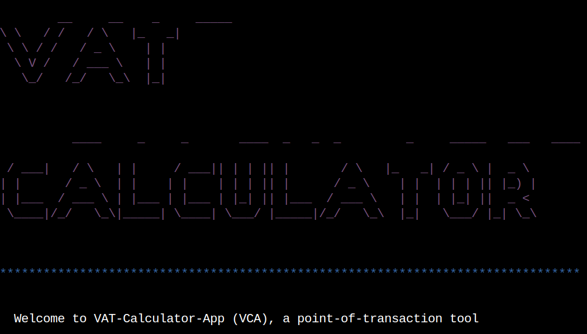
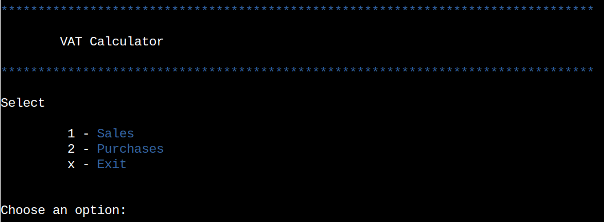
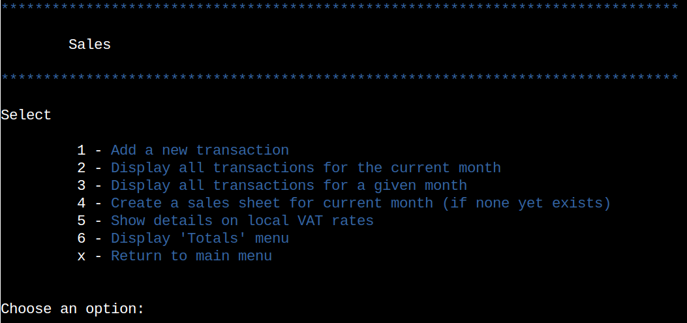
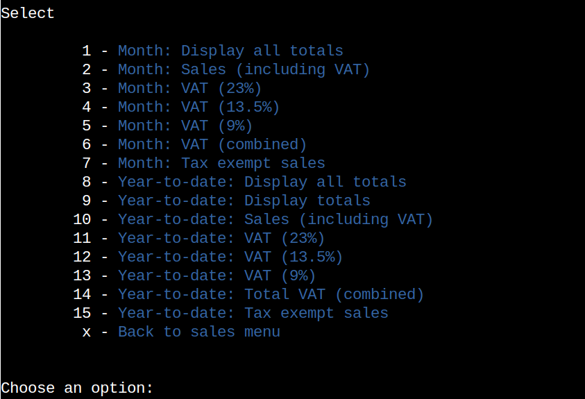

<!--  
Title
● Live Site link
● Brief Introduction
● Contents
● UX (User Experience): User Stories, User Goals
● Design: Colorama, ASCII Art, Flowchart of Logic/Functions, User Feedback
● Application Features: Python Logic, Data/APIs used (optional)
● Future Features
● Technologies Used: Languages, Libraries, Programs
● Deployment: Step by step process for deploying to Heroku, API setup (optional)
● Testing: Validation of Python, Bugs, Input testing, User Stories, (Optional: Automated Testing)
● Credits: Content References, External resources, Acknowledgements

-->

# VAT-Calculator-App 

The live application can be found here - https://vat-calculator-app-63513e79d466.herokuapp.com/

## Intro

VAT-Calculator-App is a program designed for small businesses to use at Point-of-Sale/Purchase.  By taking the small amount of time required to log each 
transaction at the point of sale or purchase, and taking care to enter the correct details and assign the correct VAT rate, the application will allow any business self-assessing for tax to track VAT owed and due on a monthly or year-to-date/annual basis, and will essentially 'do the book-keeping' for that small 
business.  I had the idea for this particular project after a discussion I had with a local small-business owner, and tried to solve for the very issue that 
they found themselves facing.  This application is currently in an MVP state and ideally will have a better front-end for a better user-experience.

## Contents

1. [Intro](#intro)

2. [Contents](#contents)

3. [UX](#ux) #
   1. [Potential Customers](#potential-customers)
   2. [User Stories](#user-stories)
   3. [Flow Chart](#flow-chart) #todo
   3. [User Goals](#user-goals) #todo

4. [Design](#design)
   1. [Colours used](#colours-used)
   3. [Welcome Message](#welcome-message)
   2. [Main Menu](#main-menu)
   4. [Purchases/Sales Menu](#purchases/sales-menu)
   5. [Totals Menu](#totals-menu)

5. [Application Features](#application-features)

6. [Future Features](#future-features)

7. [Technologies Used](#technologies-used)
   1. [Modules](#modules-used)

8. [Deployment](#deployment)
   1. [Deploying on Heroku](#deploying-on-heroku)

9. [Testing](#testing) @todo

10. [Credits](#credits) #todo
   1. [Content](#content)

## UX

### Potential Customers
  1. Small businesses looking to do their own book-keeping and keep accountacy costs low

### User Stories
  1. As a user, I want to be able to create Google sheets documents programmatically to track VAT on my purchases and sales
  2. As a user, I want to be able to update these documents
  3. As a user, I want to be able to easily view data that I have added to these documents
  4. As a user, I want to be able to navigate between sheets with as much ease as possible
  5. As a user, I want to be able to easily calculate VAT on purchases and sales for a particular month
  6. As a user, I want to be able to easily access totals for all the different VAT rates
  7. As a user, I want to be able to informed of what is happening at all times
  8. As a user, I want to the application to be intuitive
  9. As a user, I want to be able to display info about TAX rates so I can easily determine the correct rate to apply
  10. As a user, I want to be able to navigate to the previous menu easily
  11. As a user, I want to be able to exit the program programmatically

### Flow Chart

### User Goals

[Back to contents](#contents)

## Design

### Colours Used

  - To add some extra colour to the terminal I installed the 'Colorama' package,
  specifically the Fore and Init modules.

  - Unconventionally I created a class for Colors so they I could access them easily using dot notation.

  - These are the colours I used in the application

    1) blue = Fore.BLUE           (Used to create contrast on output to draw attention to the most important data)
    2) green = Fore.GREEN         (Used to display success messages to a user)
    3) red = Fore.RED             (Used for warning messages, such as when a user tries to create something that already exists)
    4) white = Fore.WHITE         (Used to make important figures pop slightly)
    5) yellow = Fore.YELLOW       (Used to draw a users attention to an action - such as 'click to continue')
    6) magenta = Fore.MAGENTA     (Used for the banner and to make things decorative occasionally)

### Welcome Message
  - Despite the size limitations of the terminal window in Heroku, I eventually opted to add a welcome message to the application

    

See here

    

### Main Menu

  - The main menu is the landing page that a user will first interact with, it is currently quite basic hiding the real functionality that lies within the
  sub-menus for Purchases and Sales, and only allows a user decide whether they wish to interact with Purchases, Sales or when finished with the application,
  Exit. 

    

See here

    

### Purchases/Sales Menu

  - The Sales/Purchases menus have 7 options to choose from
    1) Add a new transaction
        - It is assumed that a user will be using this at point-of-transaction so when a user selects to add
        a new transaction, in the background the code will determine the current month, and then check if 
        there is a sheet available for the current month.  If there is no sheet available yet for the
        current month a user will be prompted for input to decide if they would like to generate a 
        sheet for that month, and if/when the user agrees they will be prompted for the 3 pieces of information
        required to update either sheet: Details (name), Total (including VAT), and the VAT rate.

    2) Display all transactions for the current month
        - This option allows a user to view all transactions to date for the current month in the terminal.

    3) Display all transactions for the given month
        - This option allows a user to views all transactions for user determined month, if the user wishes to view 
        alternative months. The user will be presented with a list of the available months, which equates to available 
        monthly sheets, and they must choose from this list.

    4) Create a sales/purchases sheet for the current month
        - When a user selects to create a sheet the application will ask the user if they wish to proceed with creating
        a sheet for the current month or if they wish to create a sheet for another month.  If the user selects to create
        a sheet that already exists they will not be permitted.

    5) Show details on local VAT rates
      - This function displays a printout to the screen with details of tax rates and what each rate applies to so that
      any uncertainty around selecting the correct rate can be clarified within the application.

    6) Display 'Totals' menu
      - When a user selects the Display Totals menu option, they will navigate to the appropriate Display totals menu 
      depending on whether they are navigating from the sales menu or the purchases menu.  The Display totals menu offers
      many options for totalling data relating to, the current month, any particular other month, or totals for 
      year-to-date. Please see the Display Totals section below for more details.

    7) Return to the main menu
      - The return to main menu option allows a user to switch between purchases and sales menus and also provides a way
      to safely exit the program. 

    

See here

    

### Totals menu

  - The Display Totals menu has many options and is best understood by recognizing that options 1 - 7 do for one individually
  selected month what options 9 - 15 do for all the months in the year-to-date.  Option X is self explanatory.  Option 8 runs a
  combination of a few options for informative output.
  
    1) Displays a given month's totals on the screen as one line (a one-liner for options 2 - 7)  
    2) Displays totals sales for any given month available
    3) Displays total VAT at 23% for a given month
    4) Displays total VAT at 13.5% for a given month
    5) Displays total VAT at 9% for a given month
    6) Displays total VAT combined for a given month
    7) Displays total VAT exempt transactions for a given month
    8) Run option 1 for all available months and then run option 9 (it can be slow due to waits added
    to prevent breaching Google's fair usage policy on the free tier)
    Data can be slow but it is very informative
    9) Displays all year-to-date totals on the screen as one line (a one-liner for options 10 - 15)  
    10) Displays year-to-date totals sales
    11) Displays year-to-date total VAT at 23%
    12) Displays year-to-date total VAT at 13.5%
    13) Displays year-to-date total VAT at 9%
    14) Displays year-to-date total VAT combined
    15) Displays year-to-date total VAT exempt transactions

    

See here

    

[Back to contents](#contents)

## Application Features

1) Create new Google sheets programmatically guiding the user without errors occuring
2) Automatically create new sheets once a user tries to access them or attempts to add a transaction
3) Seperates Sales and Purchases out to two documents to reduce risk of error
4) Allows a user to interogate the data on the sheets for viewing
5) Allows a user the ability to sum columns on a per month basis
6) Allows a user the ability to sum columns on a year-to-date basis

[Back to contents](#contents)

## Future Features

1) Add the ability to edit and delete as currently there is no way to do this programatically, in the event that an error has been made
2) Implement a frontend that is not a terminal for improved UX
3) Add functionality to calculate VAT totals with different frequencies, 2 monthly, 3 monthly etc, to account for various pay schedules
4) The `gspread` module is powerful and I am certain that investigating further what this module can do would show other enhancements
5) Add the ability to use OCR or AI to upload text documents to Google spreadsheets so historical data can be captured and interogated more easily

[Back to contents](#contents)

## Technologies Used
- [GitHub](https://github.com)
- [Git](https://git-scm.com)
- [VS Code](https://code.visualstudio.com)
- [Heroku](https://heroku.com)
- [Pylint](https://marketplace.visualstudio.com/items?itemName=ms-python.pylint)
- [Flake8](https://marketplace.visualstudio.com/items?itemName=ms-python.flake8)
- [Code Institutes Pep8 Checker](https://pep8ci.herokuapp.com)
- [Lucid Chart](https://www.lucidchart.com)

### Modules Used
- [time](https://docs.python.org/3/library/time.html) - Sleep from time used to provide wait periods throughout
- [datetime](https://docs.python.org/3/library/datetime.html) - Correct formatting of dates for Google-sheet integration
- [os](https://docs.python.org/3/library/os.html) - Operating system level access to clear the screem so a user is focusing oon what they should
- [sys](https://docs.python.org/3/library/sys.html) - Used to exit gracefully and to emulate typewriter printout
- [Colorama](https://pypi.org/project/colorama) - Used to provide colour to the terminal and make data more readable
- [Gspread](https://docs.gspread.org/en/latest) - Used to interact with Google sheets to both write and read data, and create new sheets

[Back to contents](#contents)

## Deployment

### Deploying On Heroku

1. Navigate to the Heroku dashboard [here](https://dashboard.heroku.com/apps)
2. Click on the New dropdown in the top right corner and click to 'Create new app'
3. Choose a unique name and set the region accordingly, finally clicking create app
4. Once created it is best to navigate to the `Settings` tab to set `Config Vars` (Env variables)
5. Create a Config var called `CREDS` and set the value as the entire contents of the `creds.json` file
6. Create another Config var called `PORT` and set it to `8000`
7. Underneath Config vars now add two buildpacks maintaining this order:
    - `heroku/python`
    - `heroku/nodejs`

8. Navigate to the `Deploy` tab
9. Authenticate to your GitHub account
9. Connect to your application's GitHub repository.
10. Click on `Deploy Branch`
11. When it is deployed you can access the site by clicking `View`

[Back to contents](#contents)

## Testing 

[Back to contents](#contents)

## Credits

### Content

- The favicon icon in the tab/title bar was created by Wartini and was taken from [The Noun Project](https://thenounproject.com/browse/icons/term/calculator/)

[Back to contents](#contents)